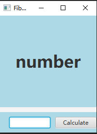

# Java Programming AU420

### 猜数游戏(Guess Number)

程序从1～1000中随机选择某个数让你猜。玩者在文本区输入第一次猜的数，然后按回车。如果猜错了，程序会在状态栏显示：Too high. Try again.（大了）或Too low. Try again.（小了）来帮助玩家修正猜测。清除文本区中的数，是用户可以输入下一个猜测值。当用户输入了正确值，则在文本区显示：Congratulations. You guessed the number! 并清除文本区，以便用户可以重新开始。

#### 用户界面

#### 功能描述

在左侧文本框中输入范围0~2000的数字，通过`Guess`按钮提交，下方文本框中会显示Too high. Try again.或Too low. Try again.（小了）来帮助玩家修正猜测；如果猜中结果，则显示恭喜信息；通过`Restart`按钮更换目标值，同时清空所有文本框。

#### 异常处理

* 输入0~2000之外的数字，则弹出消息提示超出范围。
* 输入非数字的字符，则弹出消息提示应输入数字。

#### 设计过程

本程序采用JavaFX框架，分为三个部分：

* UI界面层
  * `Button`
  * `TextField`
  * `TextArea`
* 控制层
  * `generateTarget()`
  * `handleGuessButtonAction(ActionEvent event)`
  * `handleRestartButtonAction(ActionEvent event)`
  * `clearArea()`
* 链接层

---

### Fibonacci数列

这个程序是用来显示Fibonacci数列的第n项的。Fibonacci数列是从0和1开始，并且每个数据都是它前面两个数据项之和。对话框用来使用户输入一个整数，即Fibonacci数列的第n项，然后程序在Applet中显示第n项的Fibonacci值。

#### 用户界面

#### 功能描述

在左下方的文本框中输入数列的第n项，然后在界面中心显示结果。

#### 异常处理

* 输入小于0的数字，则弹出消息提示范围错误。
* 输入非数字的字符，则弹出消息提示应输入数字。

#### 算法

考虑到递归算法所消耗的时间过大，本程序采用动态规划算法。

状态定义： 设 dp 为一维数组，其中 dp[i] 的值代表 斐波那契数列第 i 个数字 。
转移方程： dp[i + 1] = dp[i] + dp[i - 1]，即对应数列定义 f(n + 1) = f(n) + f(n - 1)；
初始状态： dp[0] = 0, dp[1] = 1，即初始化前两个数字；
返回值： dp[n]，即斐波那契数列的第 n 个数字。

#### 设计过程

本程序采用JavaFX框架，分为三个部分：

* UI界面层
  * `Button`
  * `TextField`
  * `Label`
* 控制层
  * `handleCalculateButtonAction`
  * `Fibonacci(long num)`
  * `clearLabel()`
* 链接层

---

### 矩阵运算(Matrix Operation)

实现矩阵加、减、乘法运算，矩阵维数不限，只需满足运算的规则即可，如矩阵加减法要求两个矩阵的维数相同。

#### 用户界面

#### 输入规范

分别输入两个矩阵的行数和列数，在下方输入矩阵元素，以空格作为列之间的分隔，以换行作为行之间的分隔

#### 异常处理

* 当两个矩阵的维数不相等是，进行加减操作会弹出错误提示

  

* 当第一个矩阵的列数与第二个矩阵的行数不相等时，进行乘操作会弹出错误提示

  

#### 设计过程

本程序采用JavaFX框架，分为三个部分：

* UI界面层
  * `Button`
  * `TextField`
  * `TextArea`
  * `Label`
* 控制层
  * `initMatrix()`
  * `display(int[][] result)`
  * Button
    * `addButtonAction(ActionEvent event)`
    * `minusButtonAction(ActionEvent event)`
    * `multiplyButtonAction(ActionEvent event)`
  * Operation
    * `addOperation(int[][] matrix1, int[][] matrix2)`
    * `minusOperation(int[][] matrix1, int[][] matrix2)`
    * `multiplyOperation(int[][] matrix1, int[][] matrix2)`
  * `validateAddMinus(int[][] matrix1, int[][] matrix2)`
  * `validateMultiply(int[][] matrix1, int[][] matrix2)`
* 链接层

